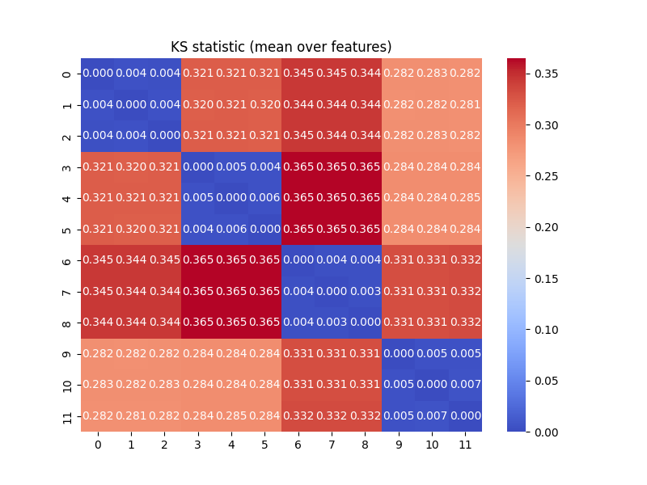
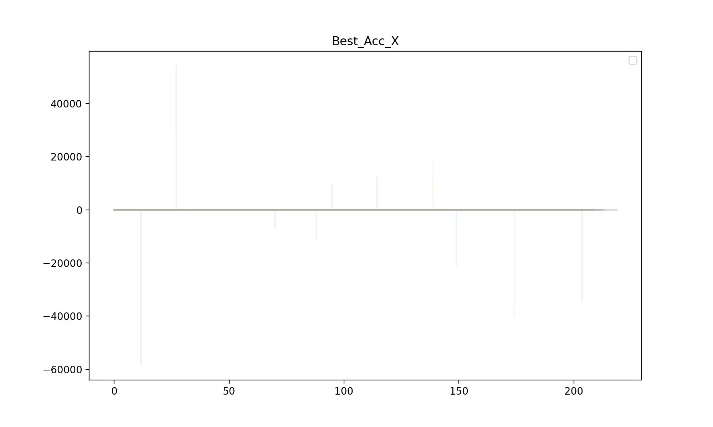
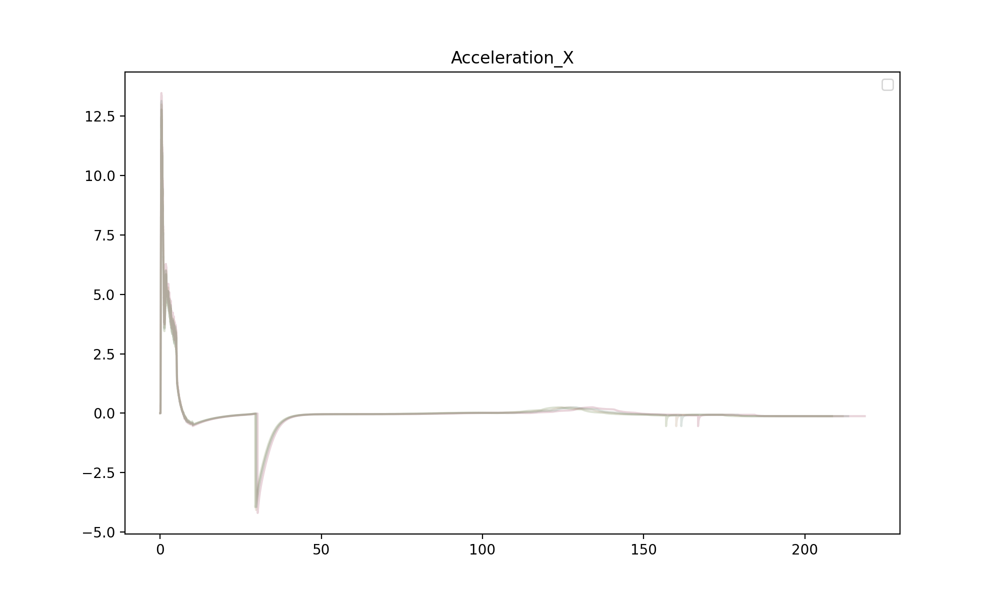
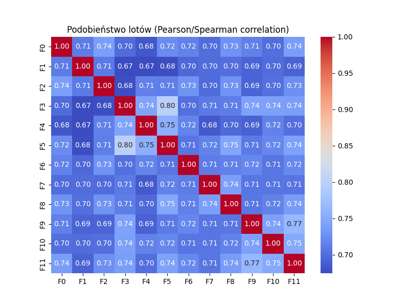

# Analiza

## Dane:
 - wygenerowałem 4 datasety po 10 lotow i z każdego z nich wybralem losowo po 3 => razem 12
 - Każdy dataset różni się losowo wybraną datą pogody (zapomniałem zapisać daty, ale jest po 1 (chyba) na każdą pore roku)
 - Nie wrzuciłem ich na gita bo nie chce robić śmietnika

## Wnioski
 - Widać róznice pomiędzy datami => git

 - Niewielka różnica w wynikach z tą samą pogodą => Trzeba pamiętać by daty się mocno różniły. Proponuję min .miesiąc roznicy
 - Mało błędów czujników => Więcej błędów i zwiększyć ich zakres (więcej małcyh odchyłów)
 
 - Błędy widać tylko na kilku wykresach (brak (albo zniknely w skali) na przyspieszeniu, pozycji itd) => Sprobujmy dodawac bledy do każdej kolumny

 - Wszystkie loty są mimo wszystko dosc podobne => wymyslec jak zwiekszyc roznorodnosc
 